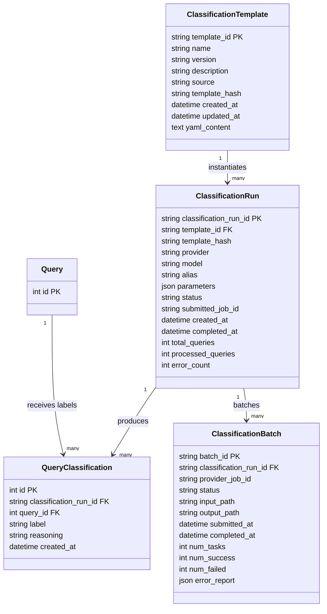

# Classification System Specification

## 1. Overview
- **Goal**: Introduce an LLM-powered classification layer that tags LMSYS queries and responses with template-defined labels (e.g., "code comment" vs. "executable code") while persisting prompts, model responses, and derived metadata.  
- **Drivers**:
  - Quantify how often AI outputs placeholder comments instead of runnable code.
- Allow analysts to run reusable classifier templates over arbitrary query subsets (cluster IDs, raw IDs, ad-hoc filters).
  - Surface classification results in the existing web interface alongside clustering summaries.
  - Support large-scale execution (10k+ classifications) using provider batch APIs or incremental disk-backed caching.

The system must integrate cleanly with current CLI/DB/web architecture, be auditable, and enable future classifier templates beyond code quality checks.

## 2. Functional Requirements
- **Classifier Runs**
  - Launch via CLI (`lmsys classify ...`) with selections by clustering run, cluster ID(s), explicit query ID list, or arbitrary SQL filter string.
  - Choose a classifier template (stored in DB or supplied via YAML) plus provider/model, parallelism, and batching strategy.
  - Resume/append behavior: skip queries already labeled for the same template hash + parameter set.
  - Persist a reference to the rendered prompt plus the normalized label and optional reasoning for each query.
- **Ad-hoc Predictions**
  - Support classifying a single text example directly from the CLI (and, in follow-on work, via API) without persisting a full run—useful for template testing and future dynamic endpoints.
- **Persistence & Auditability**
- Persist rendered prompts (deduplicated) in the database for auditability; provider responses may be logged externally if desired.
- Track each classifier run with template info, parameters, provider, alias, job status, statistics, and submission IDs when using asynchronous batch APIs.
- Ensure Instructor integrations return labels as literal strings by enforcing Pydantic models with `Literal[...]` fields per template.
- **Web UI**
  - Expose classification runs, allow filtering by classifier alias/template, show counts grouped by cluster, and drill into per-query results.
  - Overlay classification stats in existing cluster pages (e.g., stacked bars of label distribution, sortable query tables with label chips).
  - Provide bi-directional pivots: cluster → label distribution and label → cluster distribution, treating classification labels as lightweight “groups” that complement clustering.
- **Scalability**
  - Handle 10k–100k classifications via:
    - Adaptive batching and rate limiting for synchronous APIs.
    - Optional asynchronous bulk jobs (OpenAI Batch, Anthropic Tool Use, etc.) with disk-backed JSONL queue + result ingestion.
    - On-disk cache of rendered prompts + responses to avoid re-calling the LLM for identical inputs.
- **Extensibility**
- Support multiple classifier templates (YAML or JSON) referencing prompts, output schemas, label vocabularies, and Instructor-ready Pydantic models that encode labels as `Literal[...]` strings.
  - Allow custom post-processing plugins per template (e.g., normalize code fences).

## 3. Non-Functional Requirements
- **Reliability**: Idempotent CLI runs, resumable after failure, explicit error reporting per query.
- **Performance**: <5% overhead when re-running against previously classified queries; streaming progress reporting (Rich).
- **Security**: No API keys stored in DB; prompts/responses may include PII—ensure optional redaction flag prior to persistence.
- **Testing**: Unit + integration coverage for DB migrations, service orchestration, CLI command, and UI data loaders.
- **Documentation**: Public CLI help, README updates, and developer runbooks for batch mode setup.

## 4. Data Model Changes

### 4.1 SQLModel (Python) Tables
Introduce three primary tables (plus an optional batching table) in `src/lmsys_query_analysis/db/models.py`:

1. **`classification_templates`**
   - `template_id` (PK), `name`, `version`, `source` (`"db"` or `"yaml"`), `description`, `yaml_content` (TEXT), `template_hash`, `created_at`, `updated_at`.
   - Serves as the canonical store for classifier definitions. The web UI writes here first; CLI can sync templates to/from YAML files.

```python
# sqlmodel_stubs.py
from datetime import datetime
from typing import Optional, Dict, Any
from sqlmodel import SQLModel, Field, Column, JSON, Relationship


class ClassificationTemplate(SQLModel, table=True):
    __tablename__ = "classification_templates"

    template_id: str = Field(primary_key=True)
    name: str = Field(index=True)
    version: Optional[str] = None
    description: Optional[str] = None
    source: str = Field(default="db")
    yaml_content: str
    template_hash: str = Field(index=True)
    created_at: datetime = Field(default_factory=datetime.utcnow)
    updated_at: datetime = Field(default_factory=datetime.utcnow)

    runs: list["ClassificationRun"] = Relationship(back_populates="template")


class ClassificationRun(SQLModel, table=True):
    __tablename__ = "classification_runs"

    classification_run_id: str = Field(primary_key=True)
    template_id: str = Field(foreign_key="classification_templates.template_id")
    template_hash: str
    provider: str
    model: str
    alias: Optional[str] = None
    parameters: Optional[Dict[str, Any]] = Field(default=None, sa_column=Column(JSON))
    status: str = Field(default="pending")
    submitted_job_id: Optional[str] = None
    created_at: datetime = Field(default_factory=datetime.utcnow)
    completed_at: Optional[datetime] = None
    total_queries: Optional[int] = None
    processed_queries: Optional[int] = None
    error_count: Optional[int] = None

    template: Optional[ClassificationTemplate] = Relationship(back_populates="runs")
    classifications: list["QueryClassification"] = Relationship(back_populates="run")


class QueryClassification(SQLModel, table=True):
    __tablename__ = "query_classifications"

    id: Optional[int] = Field(default=None, primary_key=True)
    classification_run_id: str = Field(foreign_key="classification_runs.classification_run_id")
    query_id: int = Field(foreign_key="queries.id")
    label: str
    reasoning: Optional[str] = None
    created_at: datetime = Field(default_factory=datetime.utcnow)

    run: Optional[ClassificationRun] = Relationship(back_populates="classifications")


class ClassificationBatch(SQLModel, table=True):
    __tablename__ = "classification_batches"

    batch_id: str = Field(primary_key=True)
    classification_run_id: str = Field(foreign_key="classification_runs.classification_run_id")
    provider_job_id: Optional[str] = None
    status: str = Field(default="pending")
    input_path: Optional[str] = None
    output_path: Optional[str] = None
    submitted_at: Optional[datetime] = None
    completed_at: Optional[datetime] = None
    num_tasks: Optional[int] = None
    num_success: Optional[int] = None
    num_failed: Optional[int] = None
    error_report: Optional[Dict[str, Any]] = Field(default=None, sa_column=Column(JSON))
```



1. **`classification_templates`**
   - `template_id` (PK), `name`, `version`, `description`, `source`, `yaml_content`, `template_hash`, timestamps.
   - Sync target for YAML uploads/downloads; acts as the single source of truth for template content.

2. **`classification_runs`**
   - `classification_run_id` (PK, short uuid string `clf-YYYYmmdd-uuid`).
   - `template_id`, `template_hash`, `alias`, `provider`, `model`, `parameters` (JSON), `status`, `submitted_job_id`, `created_at`, `completed_at`, `total_queries`, `processed_queries`, `error_count`.
   - Indexes on `template_id`, `created_at`, `status`.

3. **`query_classifications`**
   - `id` (PK), `classification_run_id` (FK→`classification_runs`), `query_id` (FK→`queries`), `label`, optional `reasoning`, `created_at`.
   - Unique constraint on `(classification_run_id, query_id)`.
   - Indexes: `query_id`, `label`.

4. **`classification_batches`** (optional but required for batch API mode)
   - `batch_id` (PK), `classification_run_id` FK, `provider_job_id`, `status`, `input_path`, `output_path`, `submitted_at`, `completed_at`, `num_tasks`, `num_success`, `num_failed`, `error_report` (TEXT/JSON).

### 4.2 Drizzle (Web) Mirrors
Add mirrored tables in `web/lib/db/schema.ts` with matching columns and indexes for:
- `classificationTemplates`
- `classificationRuns`
- `queryClassifications`
- `classificationBatches`

Update `web/lib/types/schemas.ts` with inferred types.

### 4.3 Migration Strategy
- Create Alembic-style SQL script or extend current `Database.create_tables()` to include new tables.  
- Provide manual migration instructions (run CLI `lmsys db upgrade` once implemented or `uv run python -m ...`).  
- Backfill existing data is unnecessary; tables start empty.

## 5. CLI Design (`lmsys classify`)

### 5.1 Command Structure
```
lmsys classify run                 # main entrypoint
lmsys classify runs                # list existing classification runs
lmsys classify show <run_id>       # display run metadata + stats
lmsys classify resume <run_id>     # re-run unfinished classifications
lmsys classify templates list      # list stored templates (DB + synced YAML)
lmsys classify templates sync      # push/pull templates between DB and disk
lmsys classify single              # classify a single input string against a template
lmsys classify cancel <run_id>     # mark run as cancelled (future extension)
```

`lmsys classify single` executes the template and prints the label/reasoning without writing to the database; it’s intended for quick experiments and template debugging.

### 5.2 `run` Options
- `--template TEMPLATE_ID|path/to/template.yaml` *(required)* – resolves a stored template (from DB) or an ad-hoc YAML file to ingest.
- Selection filters (at least one):
  - `--run-id RUN_ID` ± `--cluster-ids "1,2,3"` (comma-separated list scoped to that run)
  - `--cluster-ids-from PATH|@-` to read newline- or comma-separated cluster IDs from a file/STDIN (pipe friendly).
  - `--query-ids 101,202,...`
  - `--sql-filter "language = 'en' AND model LIKE 'gpt%'"` (escaped string)
- Provider configuration:
  - `--model provider/model`
  - `--temperature`, `--top-p`, `--max-output-tokens`
  - `--rpm`, `--concurrency`, `--batch-size`
  - `--use-batch-api` (switch to asynchronous job mode)
- Execution flags:
- `--alias`, `--description`
- `--resume` / `--skip-existing`
- `--dry-run` (render prompts and show planned counts without calling the LLM)

### 5.3 Template Definitions
- Each template is stored as YAML (either on disk or in `classification_templates`) describing:
  - `name`, `version`, `description`
  - `input_template` (Jinja2 or similar)
  - `output_schema` (optional). If omitted, a default Pydantic model is synthesized from the declared labels using `Literal[...]`.
  - `examples` (optional few-shot list with arbitrary objects; renderer serializes to XML snippets based on keys)
  - `labels` (enum definitions, UI coloring)
  - `post_process` script hook name (optional)
- CLI loads templates by first syncing YAML into the DB (if a file path is supplied) and then referencing the stored `template_id`. The template hash is captured on the run for provenance.
- Template sync follows a last-writer-wins strategy keyed by the template hash and `updated_at`; newer edits (from CLI or UI) overwrite older YAML/DB versions.
- Provide canonical Python stub alongside each template that constructs an Instructor client with literal-string labels (`Literal["label_a", "label_b", ...]`).
- **Example** (`configs/classifiers/conversation-friction.yaml`) — can be authored manually or generated through the web “Create Classifier” flow:
  ```yaml
  name: conversation-friction
  description: Detect user frustration or the agent running in loops.
  labels:
    frustrated_user:
      color: red
      description: User expresses frustration, annoyance, or dissatisfaction.
    agent_loop:
      color: orange
      description: Agent repeatedly responds without making progress.
    ok:
      color: green
      description: No notable frustration or looping detected.
  examples:
    - input: |
        User: My code still fails after five tries; this is useless.
        Agent: Let's try the same fix again.
      label: frustrated_user
    - input: |
        User: Thanks!
        Agent: You're welcome! Anything else?
        Agent: You're welcome! Anything else?
      label: agent_loop
  schema: classifiers.schemas:ConversationFriction  # exposes Literal["frustrated_user","agent_loop","ok"]
  input_template: |
    You analyze a chat between a user and an AI agent.
    Output exactly one label: "frustrated_user", "agent_loop", or "ok".

    Conversation:
    {{ conversation_text }}
  ```
  ```python
  # classifiers/schemas.py
  from typing import Literal
  from pydantic import BaseModel

  class ConversationFriction(BaseModel):
      label: Literal["frustrated_user", "agent_loop", "ok"]
      reasoning: str
  ```

### 5.4 Execution Flow
1. Resolve query set (SQL join with clusters if provided) and retain the clustering context in memory for reporting (no additional columns stored on `query_classifications`).
2. Render prompt template (inject few-shot examples, if provided) and compute a canonical hash for optional caching/telemetry; the run already stores the originating `template_hash` for provenance.
3. If the `(classification_run_id, query_id)` pair already exists, skip unless `--resume`/`--retry-failed` forces reprocessing.
4. Otherwise, execute classifier call:
   - **Sync mode**: Submit to provider via Instructor/SDK with concurrency + rate limiting. Capture latency + tokens.
   - **Batch mode**: Write JSONL tasks to disk (`.lmsys-query-analysis/batches/<run_id>/input.jsonl`), submit via provider Batch API, store `provider_job_id`. Poll job status asynchronously; separate CLI command `lmsys classify ingest <run_id>` to ingest completed batch output.
5. Normalize provider response into `label` and optional `reasoning` string.
6. Insert/refresh the `query_classifications` row (run ID + query ID + label/reasoning).
7. Update `classification_runs` statistics + status.
8. When `lmsys classify single` is invoked, skip persistence entirely and simply stream the prediction to stdout.

### 5.5 Error Handling
- Record per-query failures with `label="ERROR"` and include the failure message in `reasoning`.
- Provide `--retry-failed` CLI option that replays only errored items (ignoring successful ones).
- When using batch APIs, capture per-task status from provider output.

### 5.6 Prompt Configuration Patterns
Offer multiple CLI ergonomics so analysts can choose between reusable templates and ad-hoc prompts:

1. **Stored Template (default)**  
   ```bash
   lmsys classify run \
     --template conversation-friction \
     --run-id run-20241001 \
     --cluster-ids "17,29,31" \
     --model openai/gpt-4o-mini
   ```  
   - Resolves `conversation-friction` from `classification_templates`. If the template originated from YAML, the CLI ensures the DB copy is up to date before launching the run.
   - Optional overrides: `--schema-module module:ClassModel` to swap the Instructor schema while keeping other template defaults.

2. **Inline Prompt / Schema Override**  
   ```bash
   lmsys classify run \
     --template adhoc-comment-check.yaml \
     --prompt @- \
     --schema "from classifiers.schemas import CommentCheck" \
     --run-id run-20241001 \
     --cluster-ids "42"
   ```  
   - When `--template` points to a YAML file that doesn’t yet exist in the DB, the CLI ingests it, assigns/returns a `template_id`, then proceeds.
   - `--prompt` accepts literal strings and supports multi-line input by using the `@-` convention to read from STDIN. Example:
     ```bash
     lmsys classify run --prompt @- ... <<'PROMPT'
     You are a classifier. Output one of the literal labels: "comment_only" or "code_present".
     Analyze the following snippet:
     {{ query_text }}
     PROMPT
   ```
   - When paired with `--schema`, the CLI dynamically loads the Python object that defines the Instructor literal labels.  
   - For longer prompts use `--prompt-file path/to/prompt.jinja`.

3. **Pipe Cluster IDs from Search Output**  
   ```bash
   lmsys search-cluster "code placeholder" --run-id run-20241001 --json \
     | jq -r '.[].cluster_id' \
     | lmsys classify run \
        --template conversation-friction \
        --run-id run-20241001 \
        --cluster-ids-from @- \
        --model openai/gpt-4o-mini
   ```  
   - `--cluster-ids-from @-` consumes newline- or comma-separated IDs from STDIN, making it easy to feed the results of `list-clusters` or `search-cluster` directly into classification runs.

Regardless of entrypoint, the CLI renders the prompt with Jinja (providing query text, cluster context, etc.), constructs the Instructor client using the supplied schema (ensuring literal-class string outputs), then executes as described above.

Templates authored via the web UI land in `classification_templates` and are immediately available to the CLI. `lmsys classify templates sync` exports/imports YAML so analysts can iterate between UI prototyping and automated batch runs seamlessly.

## 6. Services Layer

### 6.1 New Module: `classification_service.py`
- Responsibilities:
  - Create/lookup classification runs.
  - Gather target queries and stage classification requests based on a template.
  - Coordinate prompt rendering, provider calls, and persistence.
  - Expose resume, batch ingest, statistics computation.
- Interfaces:
  - `start_run(ClassificationRequest) -> classification_run_id`
  - `process_sync(...)` and `enqueue_batch(...)`
  - `ingest_batch_results(classification_run_id, path|job_id)`
  - `summaries_by_cluster(classification_run_id) -> Dict[cluster_id, label_counts]`
- Utilizes helper components:
  - `PromptRenderer` (Jinja2 templating + few-shot injection)
  - `ProviderClient` abstraction with implementations for synchronous APIs and batch submission.
  - `TemplateRepository` to load/store YAML templates in the DB and keep hashes in sync with disk copies.
  - `InstructorFactory` helper that loads the template’s Pydantic schema and returns an Instructor client configured to emit literal string labels (via `Literal[...]`), ensuring deterministic serialization.

### 6.2 Supporting Utilities
- `batch_executor.py`: writes JSONL payload, submits to provider (OpenAI `client.batches.create(...)`), polls status, downloads results to disk, triggers ingestion.
- Rate limit management via existing `aiolimiter` utilities, reusing summarizer/hierarchy patterns.

## 7. Web UI Enhancements

### 7.1 Data Access (`web/app/actions.ts`)
- Add fetchers:
  - `getClassificationRuns()`, `getClassificationRun(runId)`
  - `createClassificationTemplate(payload)`, `listClassificationTemplates()`, `syncTemplateToFile(templateId, path)`
  - `getClusterClassificationSummary(runId, classificationRunId)`
  - `getQueryClassifications({ runId, clusterId, classificationRunId, page, label })`
  - `searchClassifications(query, templateName, runId?)`
  - `getLabelPivot(runId, classificationRunId)` to fetch both cluster→label and label→cluster distributions.
  - Batch status endpoints if asynchronous mode is used.
- Update Drizzle schema to include new tables and indexes.

### 7.2 Pages & Components
- **Runs Overview** (`/classifications`):
  - Table listing classifier runs (template, alias, model, totals, created date, status badges).
  - Filters by template, provider, associated clustering run.
- **Create Classifier UI** (`/classifications/new` or modal):
  - Guided form for defining templates like the "conversation-friction" example without manual YAML edits.
  - Inputs: name, description, literal labels (comma-separated), prompt template (multi-line textarea with Jinja hints), optional reasoning toggle, reusable few-shot examples (list of `input` + `label` pairs).
  - Auto-generates the Instructor schema preview (`Literal["frustrated_user","agent_loop","ok"]`) and allows downloading/saving the YAML + Python stub.
  - Optional step to launch a run immediately by selecting clustering run + cluster IDs (supports piping selections from search results).
- **Classification Detail** (`/classifications/[classificationRunId]`):
  - Summary cards (total queries, distinct prompts reused, error count).
  - Distribution chart (pie/bar) of labels overall + by top clusters.
  - Table of clusters with counts + link to `/runs/{runId}?classifier=<id>`.
  - Pivot controls to toggle between "cluster → classification label" and "classification label → cluster" distributions, treating labels as lightweight groups.
- **Cluster Page Additions** (`/clusters/[runId]/[clusterId]`):
  - Tabs to switch between "Queries" and "Classifications".
  - Label distribution chips, filter, and search within classification results.
  - Display reasoning text and an optional prompt preview per query (collapsible to avoid overwhelming UI).
- **Query Search UI**:
  - Extend existing search results to show latest classification labels for each query (per selected template) and allow filtering by label group.

### 7.3 Performance Considerations
- Paginate query classifications (default 50/page as existing queries).
- Precompute cluster-level aggregates on ingestion (store in `classification_runs` JSON stats or derived view) to avoid heavy `GROUP BY` queries on every request.
- Lazy-load prompt bodies and reasoning text (request on demand) to minimize payload size.

## 8. Scaling & Caching Strategy

- **Prompt Hashing**: SHA-256 of canonicalized prompt content + template hash ensures identical semantics across runs.  
- **Disk Cache Layout**:
  ```
  ~/.lmsys-query-analysis/classifier-cache/
    prompts/<hash>.json         # rendered prompt + metadata
    responses/<hash>.json       # provider response payload
  ```
  - The cache directory keeps optional rendered prompt/response payloads keyed by hash without bloating the main database; runs continue to store only labels + reasoning.
  - TTL or LRU cleanup command (`lmsys classify purge-cache --days 30`).
- **Batch API Workflow**:
  - CLI writes input JSONL with records `{custom_id, body}`.
  - Submit to provider; record job ID in `classification_batches`.
  - Periodic `lmsys classify poll` command checks job status, downloads output JSONL, updates DB.
  - Allow partial ingestion for large outputs (stream parse).
- **Throughput Targets**:
  - Sync mode: 30–60 concurrent requests w/ rate limiter (~2-3k/hour).
  - Batch mode: 100k tasks per job (provider limit).
  - Cache hit rate >50% expected for reruns; verify by tracking metrics in `classification_runs`.

## 9. Testing Strategy
- **Unit Tests**:
  - Prompt rendering, cache key hashing, provider adapters (use stub clients), DB model constraints.
  - Template parsing + schema validation.
- **Integration Tests**:
  - CLI `classify run` against in-memory SQLite with mocked provider returning deterministic responses.
  - Batch ingest path with fixture JSONL.
- **Web UI**:
  - Playwright/React Testing Library for new components (label distribution chart, classification tables).
  - Snapshot tests for Drizzle actions.
- **Load Tests** (optional):
  - CLI benchmark suite that simulates 10k classifications using stub provider to measure throughput + memory usage.

## 10. Observability & Instrumentation
- Extend logging with structured events (`ClassificationRunStarted`, `ClassificationTemplateSynced`, `ClassificationBatchSubmitted`, etc.).
- Store runtime metrics (avg latency, total processed, prompt reuse counts) in `classification_runs.parameters["metrics"]`.
- Provide `lmsys classify stats <run_id>` CLI command to print summary.
- Web UI to display metrics via badges/tooltips.

## 11. Open Questions & Future Work
- Should prompt/response storage support optional encryption at rest?
- Need policy for redacting code snippets containing secrets.
- Cross-run label harmonization: do we need a global `classification_labels` table for consistent color assignments?
- Potential to schedule classification runs automatically after clustering? (Cron integration).
- Streaming provider responses vs. single shot; support multi-turn classification?
- FastAPI backend: design a service layer that mirrors CLI capabilities (including `classify single`) so the web app can call REST endpoints instead of direct server actions. Draft a dedicated spec covering template management endpoints, run orchestration, and streaming prediction APIs.

---
This specification outlines the architecture and integration points required to add a robust LLM classification layer to LMSYS Query Analysis, covering persistence, CLI flow, UI presentation, and scalability considerations. Implementation should proceed in staged milestones (schema, services, CLI, batch mode, UI) with migrations and documentation reviewed prior to deployment.
