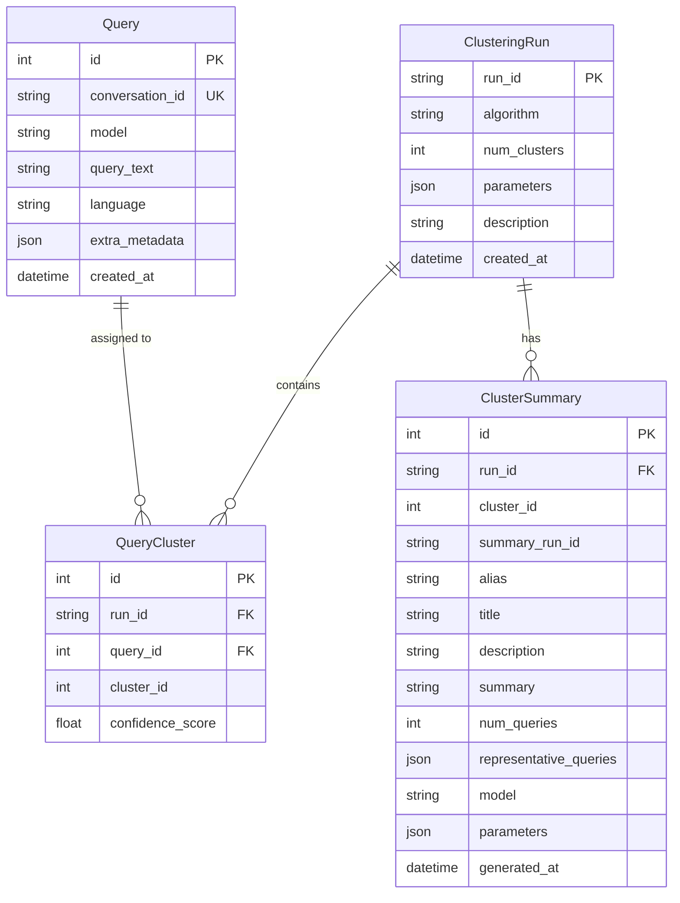

# Database Models

The project uses SQLModel for database schema definition and ORM functionality.

## Query

Represents a single user query from the LMSYS-1M dataset.

### Fields

- **id** (int): Auto-incremented primary key
- **conversation_id** (str): Unique identifier from LMSYS dataset
- **model** (str): LLM model used in conversation
- **query_text** (str): First user message in conversation
- **language** (str | None): Detected language of query
- **extra_metadata** (dict | None): Additional JSON metadata
- **created_at** (datetime): Timestamp of record creation

### Example

```python
from lmsys_query_analysis.db.models import Query

query = Query(
    conversation_id="conv_12345",
    model="gpt-3.5-turbo",
    query_text="How do I center a div in CSS?",
    language="en"
)
```

---

## ClusteringRun

Tracks clustering experiments and their parameters.

### Fields

- **run_id** (str): Unique identifier (e.g., "kmeans-100-20251003-123456")
- **algorithm** (str): Clustering algorithm ("kmeans" or "hdbscan")
- **num_clusters** (int | None): Number of clusters (KMeans only)
- **parameters** (dict | None): Algorithm parameters as JSON
- **description** (str | None): Optional user description
- **created_at** (datetime): Timestamp of run creation

### Example

```python
from lmsys_query_analysis.db.models import ClusteringRun

run = ClusteringRun(
    run_id="kmeans-100-20251003-123456",
    algorithm="kmeans",
    num_clusters=100,
    parameters={"batch_size": 4096},
    description="Fine-grained clustering"
)
```

---

## QueryCluster

Maps queries to clusters within a specific run.

### Fields

- **id** (int): Auto-incremented primary key
- **run_id** (str): Foreign key to ClusteringRun
- **query_id** (int): Foreign key to Query
- **cluster_id** (int): Cluster assignment
- **confidence_score** (float | None): Confidence or distance score

### Example

```python
from lmsys_query_analysis.db.models import QueryCluster

assignment = QueryCluster(
    run_id="kmeans-100-20251003-123456",
    query_id=42,
    cluster_id=5,
    confidence_score=0.85
)
```

---

## ClusterSummary

LLM-generated summaries for clusters. **Supports multiple summary runs** to compare different models and parameters.

### Fields

- **id** (int): Auto-incremented primary key
- **run_id** (str): Foreign key to ClusteringRun
- **cluster_id** (int): Cluster number
- **summary_run_id** (str): Unique ID for this summarization (e.g., "summary-claude-sonnet-4-5-2025-20251004-124530")
- **alias** (str | None): Friendly name for this summary run (e.g., "claude-v1", "gpt4-best", "production")
- **title** (str | None): Short cluster title
- **description** (str | None): Detailed description
- **summary** (str | None): Combined title + description (backward compat)
- **num_queries** (int): Count of queries in cluster
- **representative_queries** (list | None): Sample queries as JSON
- **model** (str | None): LLM model used (e.g., "anthropic/claude-sonnet-4-5-20250929")
- **parameters** (dict | None): Summarization parameters (max_queries, concurrency, contrast settings, etc.)
- **generated_at** (datetime): Timestamp of summary creation

### Example

```python
from lmsys_query_analysis.db.models import ClusterSummary

summary = ClusterSummary(
    run_id="kmeans-100-20251003-123456",
    cluster_id=5,
    summary_run_id="summary-claude-sonnet-4-5-2025-20251004-124530",
    alias="claude-v1",  # Friendly name for easy reference
    title="CSS Layout Questions",
    description="Queries about CSS positioning, flexbox, and grid layouts",
    num_queries=150,
    representative_queries=["How to center a div?", "Flexbox vs Grid?"],
    model="anthropic/claude-sonnet-4-5-20250929",
    parameters={"max_queries": 100, "concurrency": 12}
)
```

### Multiple Summary Runs

You can create multiple summaries for the same cluster using different models:

```python
# Compare Claude and GPT-4 summaries using aliases
claude_summary = ClusterSummary(
    run_id="kmeans-100-20251003-123456",
    cluster_id=5,
    summary_run_id="summary-claude-sonnet-4-5-2025-20251004-124530",
    alias="claude-v1",  # Easy to remember!
    model="anthropic/claude-sonnet-4-5-20250929",
    ...
)

gpt4_summary = ClusterSummary(
    run_id="kmeans-100-20251003-123456",
    cluster_id=5,
    summary_run_id="summary-gpt-4-20251004-124600",
    alias="gpt4-test",  # Easy to remember!
    model="openai/gpt-4",
    ...
)
```

---

## Database Schema



## Usage

### Creating a Database Session

```python
from lmsys_query_analysis.db.connection import DatabaseManager

db = DatabaseManager("~/.lmsys-query-analysis/queries.db")
session = db.get_session()

# Query data
from lmsys_query_analysis.db.models import Query
from sqlmodel import select

statement = select(Query).limit(10)
queries = session.exec(statement).all()
```

### Querying Clusters

```python
from lmsys_query_analysis.db.models import ClusterSummary
from sqlmodel import select

# Get all summaries for a specific summary run by alias (easiest!)
statement = select(ClusterSummary).where(
    ClusterSummary.run_id == "kmeans-100-20251003-123456",
    ClusterSummary.alias == "claude-v1"
)
summaries = session.exec(statement).all()

# Or by summary_run_id
statement = select(ClusterSummary).where(
    ClusterSummary.run_id == "kmeans-100-20251003-123456",
    ClusterSummary.summary_run_id == "summary-claude-sonnet-4-5-2025-20251004-124530"
)
summaries = session.exec(statement).all()

# Get latest summary run for a clustering run
statement = select(ClusterSummary).where(
    ClusterSummary.run_id == "kmeans-100-20251003-123456"
).order_by(ClusterSummary.generated_at.desc()).limit(1)
latest_summary = session.exec(statement).first()

# Get clusters sorted by size for a specific alias
statement = select(ClusterSummary).where(
    ClusterSummary.run_id == "kmeans-100-20251003-123456",
    ClusterSummary.alias == "claude-v1"
).order_by(ClusterSummary.num_queries.desc())
top_clusters = session.exec(statement).all()

# Compare summaries from different models by alias
claude_stmt = select(ClusterSummary).where(
    ClusterSummary.run_id == "kmeans-100-20251003-123456",
    ClusterSummary.cluster_id == 5,
    ClusterSummary.alias == "claude-v1"
)
gpt4_stmt = select(ClusterSummary).where(
    ClusterSummary.run_id == "kmeans-100-20251003-123456",
    ClusterSummary.cluster_id == 5,
    ClusterSummary.alias == "gpt4-test"
)
```

## Next Steps

- [CLI Reference](../cli/overview.md)
- [Clustering API](clustering.md)
