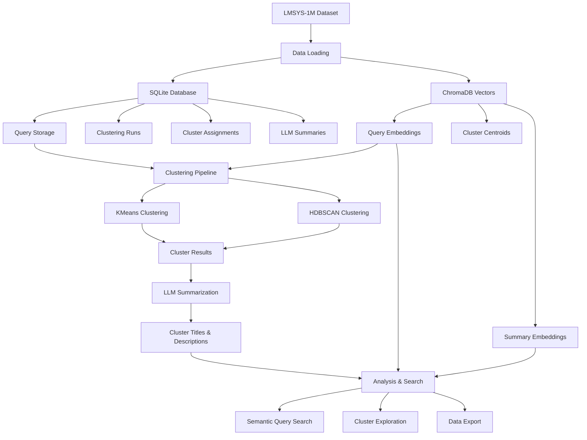
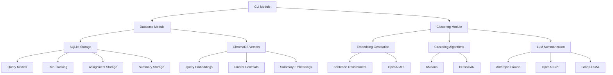
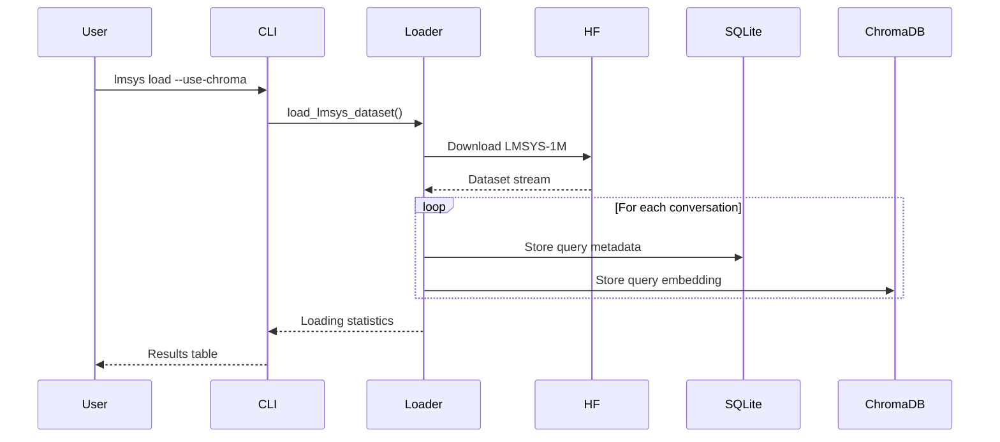
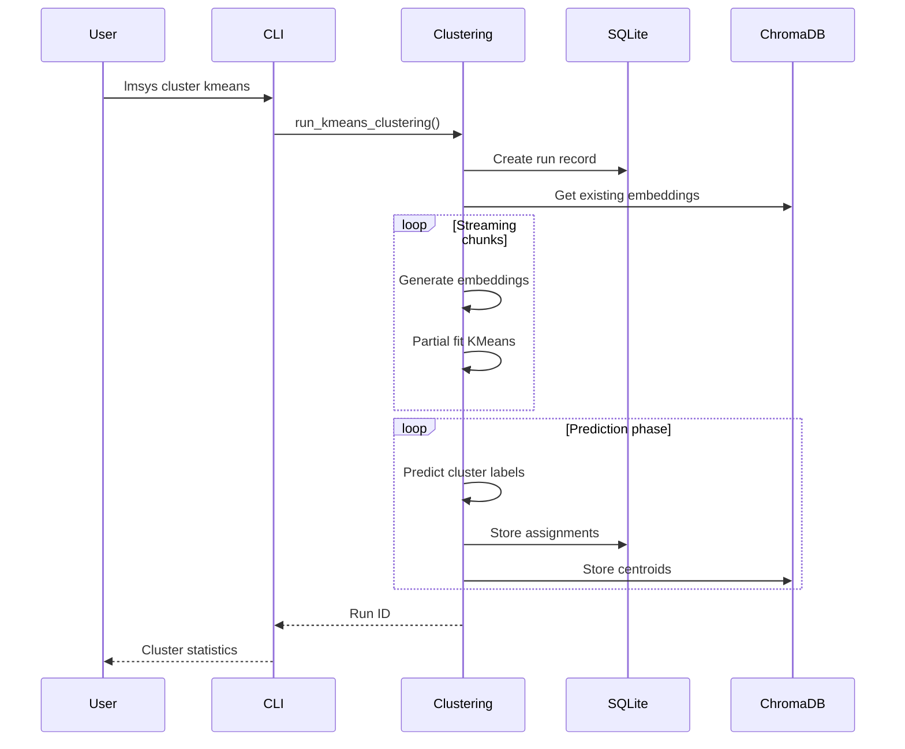
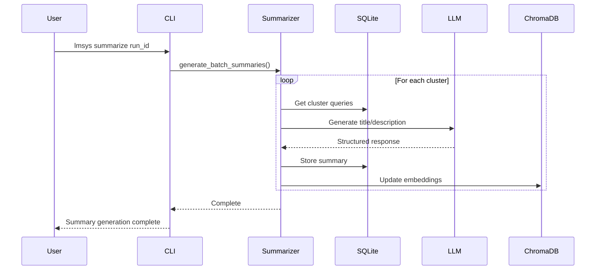
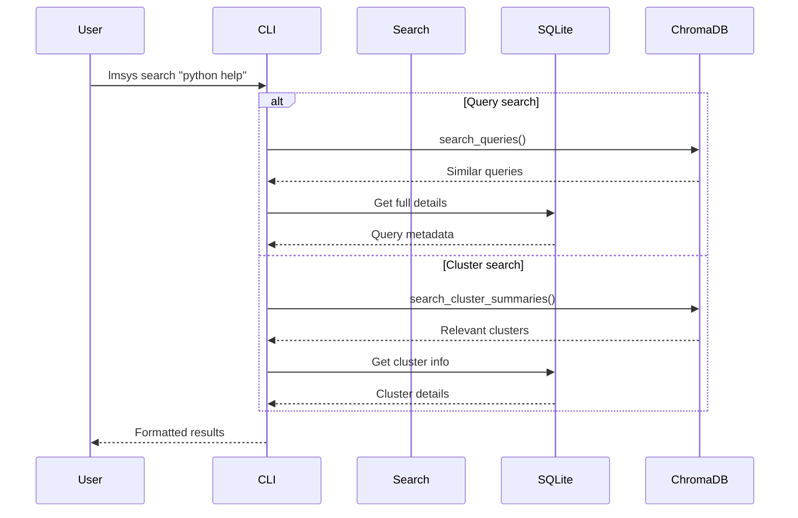

# LMSYS Query Analysis

A comprehensive tool for analyzing the LMSYS-1M dataset through clustering and semantic search. This system enables researchers and developers to understand user query patterns, identify common use cases, and explore the conversational AI landscape.

## System Overview

## Module Architecture

## Data Flow

### 1. Data Loading Phase

### 2. Clustering Phase

### 3. Summarization Phase

### 4. Analysis Phase

## Key Features

### Data Management
- **Flexible Loading**: Configurable limits and filtering
- **Incremental Updates**: Skip existing data, resume loading
- **Metadata Preservation**: All original conversation data retained
- **Progress Tracking**: Real-time loading statistics

### Clustering Capabilities
- **Multiple Algorithms**: KMeans and HDBSCAN support
- **Scalable Processing**: Memory-efficient streaming for large datasets
- **Embedding Flexibility**: Local models or cloud APIs
- **Run Tracking**: Complete experiment history

### Analysis Tools
- **Semantic Search**: Find similar queries or clusters
- **Cluster Exploration**: Detailed inspection of query groups
- **Export Options**: CSV and JSON output formats
- **Rich Display**: Beautiful terminal tables and progress bars

### LLM Integration
- **Multi-Provider**: Anthropic, OpenAI, and Groq support
- **Structured Output**: Reliable parsing with Pydantic models
- **Batch Processing**: Efficient summary generation
- **Error Handling**: Graceful fallbacks for API failures

## Usage Patterns

### Research Workflow
1. **Load Dataset**: `lmsys load --limit 50000 --use-chroma`
2. **Cluster Analysis**: `lmsys cluster kmeans --n-clusters 500`
3. **Generate Summaries**: `lmsys summarize run_id --use-chroma`
4. **Explore Results**: `lmsys list-clusters run_id`
5. **Search Patterns**: `lmsys search "programming help"`
6. **Export Data**: `lmsys export run_id --output analysis.csv`

### Development Workflow
1. **Quick Testing**: Small dataset loads for algorithm testing
2. **Parameter Tuning**: Multiple clustering runs with different parameters
3. **Quality Assessment**: Manual inspection of cluster quality
4. **Iterative Improvement**: Refine algorithms based on results

## Performance Characteristics

### Scalability
- **Memory Efficient**: Streaming processing for datasets >1M queries
- **Parallel Processing**: Multi-core utilization for clustering
- **Batch Operations**: Optimized database and API operations
- **Caching**: Embedding reuse prevents redundant computation

### Storage Requirements
- **SQLite**: ~100MB per 10K queries (metadata only)
- **ChromaDB**: ~500MB per 10K queries (with embeddings)
- **Total**: ~600MB per 10K queries for full functionality

### Processing Times
- **Loading**: ~1000 queries/second
- **Embedding**: ~500 queries/second (local models)
- **Clustering**: ~10K queries/minute (KMeans)
- **Summarization**: ~50 clusters/minute (depends on LLM provider)

## Integration Points

### External Dependencies
- **HuggingFace**: Dataset loading and model hosting
- **SQLModel**: Database ORM and migrations
- **ChromaDB**: Vector storage and similarity search
- **Rich**: Terminal UI and progress display
- **Typer**: CLI framework and argument parsing

### API Integrations
- **OpenAI**: Embedding generation and LLM summarization
- **Anthropic**: LLM summarization
- **Groq**: Fast LLM inference for summarization
- **Sentence Transformers**: Local embedding models

This architecture provides a robust foundation for large-scale query analysis while maintaining flexibility for different research and development needs.
