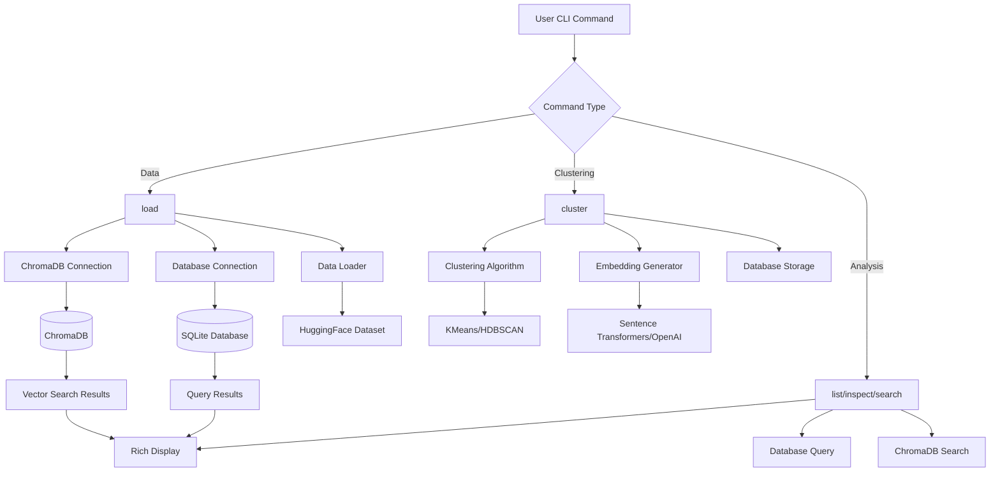
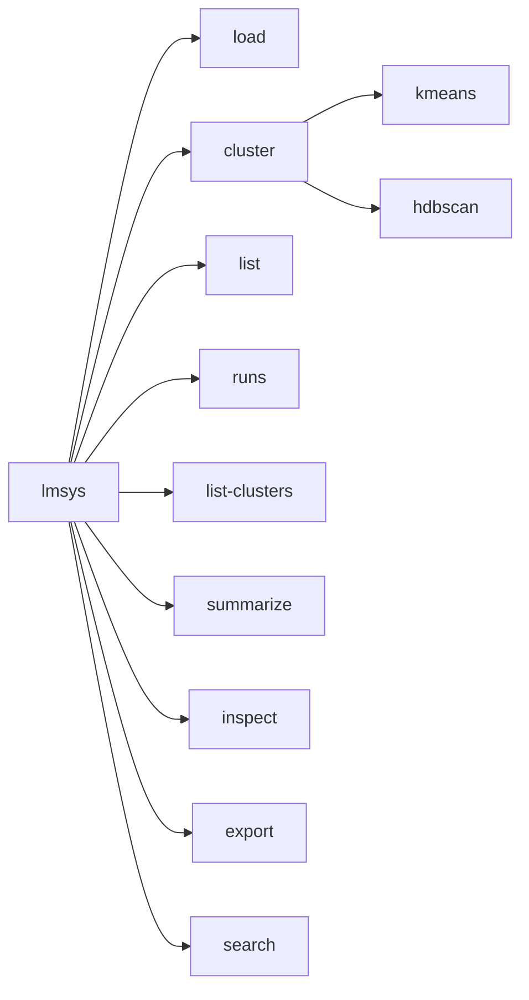

# CLI Module

The CLI module provides the command-line interface for the LMSYS Query Analysis tool. It's built with Typer and Rich for a modern terminal experience.

## Overview

The CLI offers commands for data loading, clustering analysis, and result exploration. It acts as the main entry point for all functionality.

## Commands

### Data Management
- `load` - Download and load LMSYS-1M dataset
- `list` - List queries with filtering options
- `runs` - List all clustering runs
- `export` - Export cluster results to CSV/JSON

### Clustering
- `cluster kmeans` - Run MiniBatchKMeans clustering
- `cluster hdbscan` - Run HDBSCAN clustering
- `summarize` - Generate LLM summaries for clusters

### Analysis
- `list-clusters` - List clusters for a run
- `inspect` - Inspect specific cluster details
- `search` - Semantic search across queries or clusters

## Architecture Flow



## Key Components

### Main CLI App
- **Typer app**: Main application with subcommands
- **Rich console**: Beautiful terminal output with tables and progress bars
- **Logging setup**: Configurable verbose logging

### Command Structure


### Error Handling
- Try-catch blocks around all major operations
- Graceful failure with informative error messages
- Exit codes for programmatic usage

### Configuration
- Default paths for database and ChromaDB
- Optional command-line overrides
- Environment variable support for API keys

## Usage Examples

```bash
# Load data with ChromaDB
lmsys load --limit 10000 --use-chroma

# Run clustering
lmsys cluster kmeans --n-clusters 200 --use-chroma

# Generate summaries
lmsys summarize run_id --use-chroma

# Search queries
lmsys search "python programming" --search-type queries

# Export results
lmsys export run_id --output results.csv
```

## Integration Points

The CLI integrates with:
- **Database module**: For data persistence and queries
- **Clustering module**: For embedding generation and clustering algorithms
- **ChromaDB module**: For vector storage and semantic search
- **External APIs**: HuggingFace datasets, OpenAI embeddings, LLM providers
