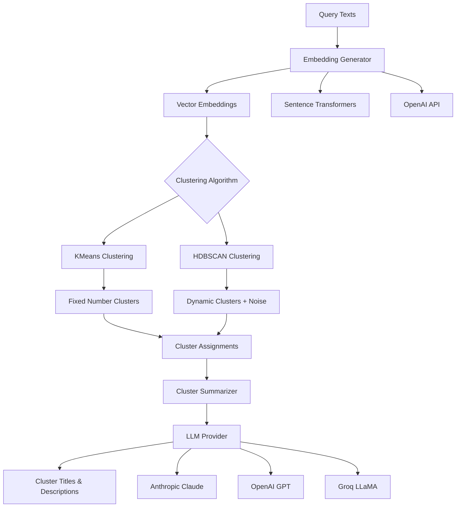
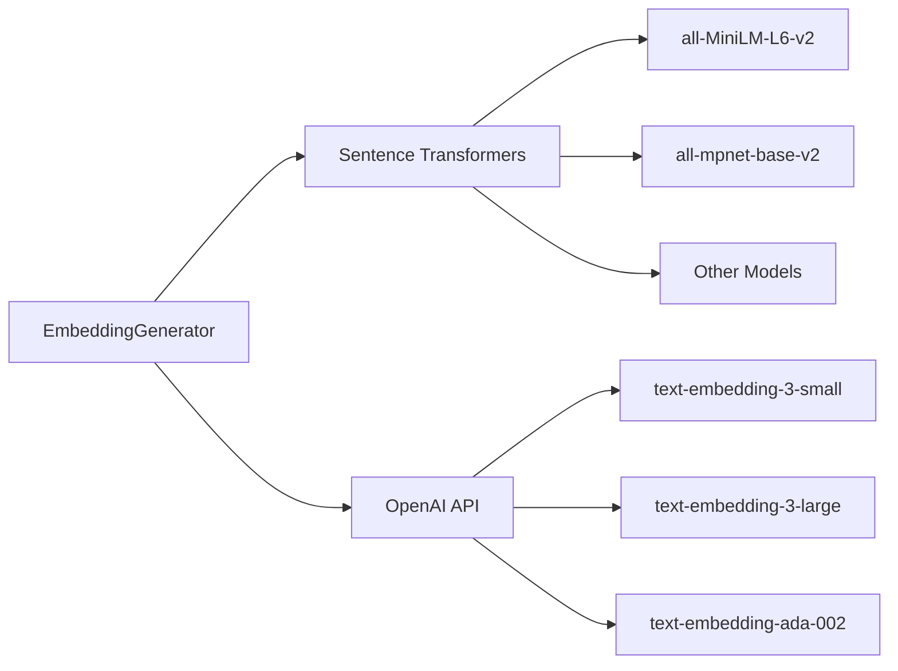
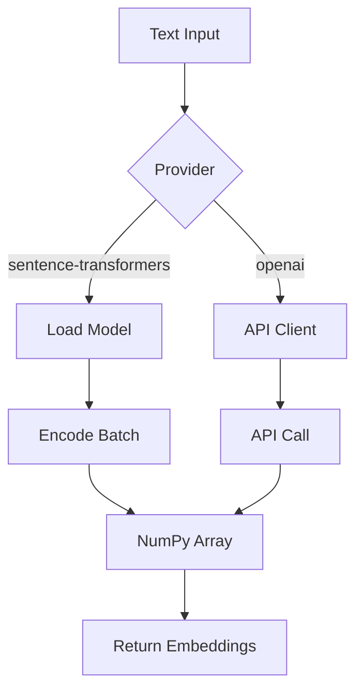
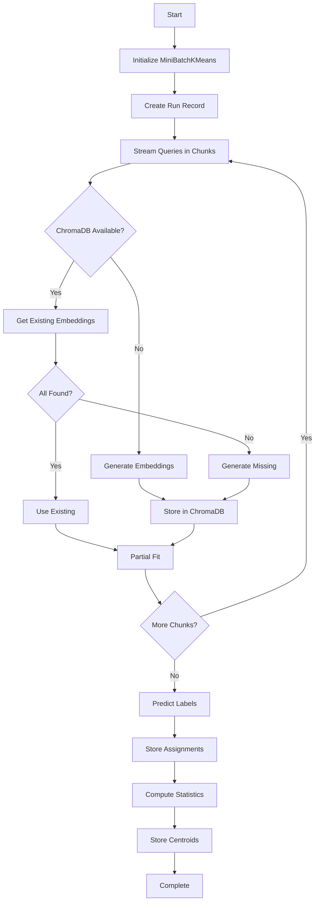
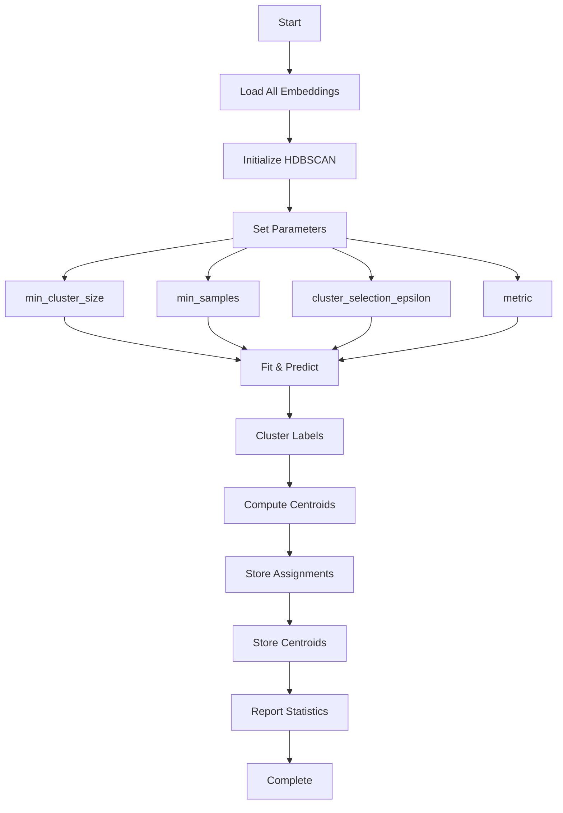
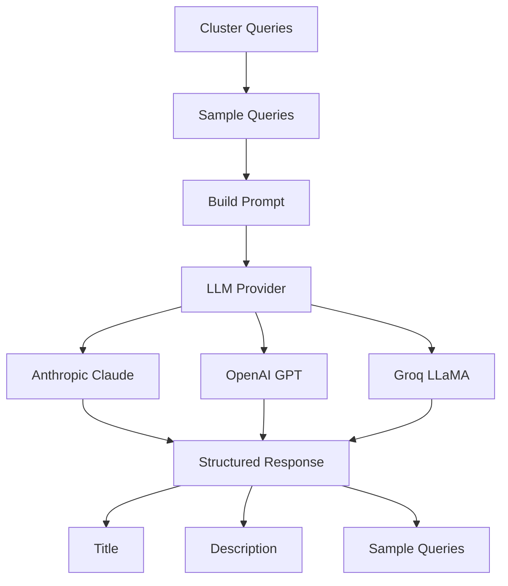
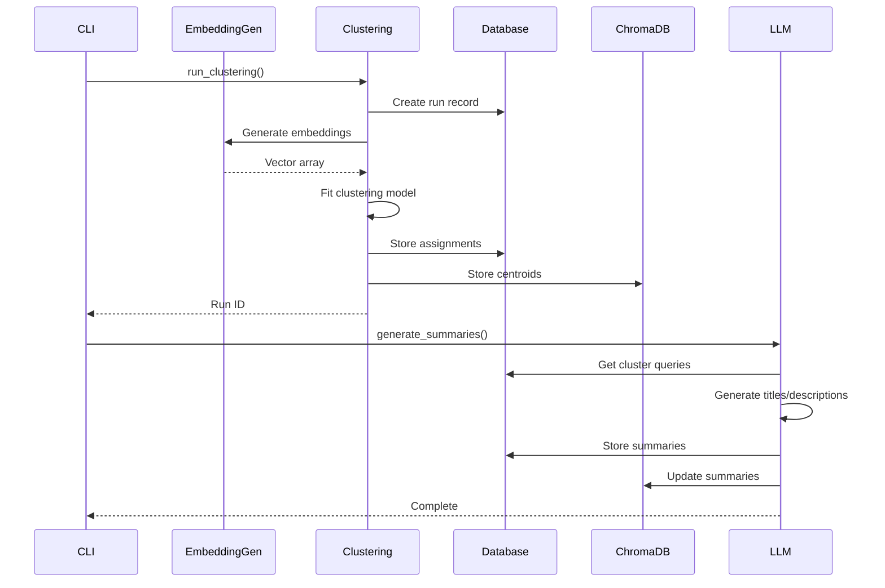
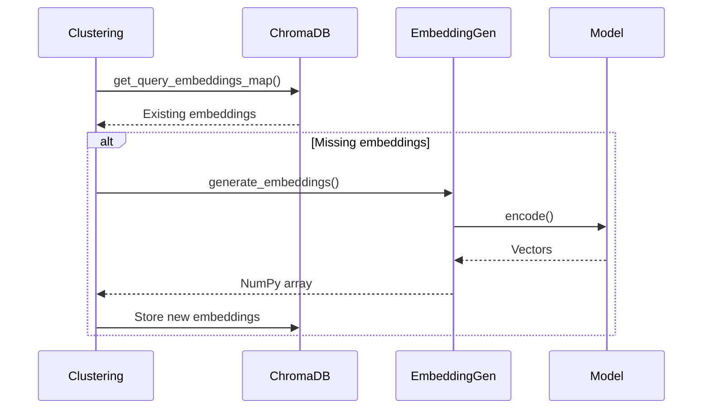

# Clustering Module

The clustering module provides embedding generation and clustering algorithms for analyzing LMSYS query patterns. It supports both KMeans and HDBSCAN clustering with optional LLM-powered summarization.

## Overview

This module enables semantic analysis of user queries through:
1. **Embedding Generation**: Convert text to vector representations
2. **Clustering Algorithms**: Group similar queries
3. **LLM Summarization**: Generate human-readable cluster descriptions

## Architecture



## Core Components

### Embedding Generator (embeddings.py)

**Purpose**: Generate vector embeddings from text using different providers

**Supported Providers**:


**Key Features**:
- **Batch Processing**: Efficient encoding of multiple texts
- **Progress Tracking**: Rich progress bars for long operations
- **Model Caching**: Lazy loading and reuse of models
- **Performance Metrics**: Timing and throughput reporting

**Process Flow**:


### KMeans Clustering (kmeans.py)

**Purpose**: MiniBatchKMeans clustering with streaming embeddings for large datasets

**Algorithm Flow**:


**Key Features**:
- **Streaming Processing**: Handles datasets larger than memory
- **Embedding Reuse**: Leverages ChromaDB to avoid recomputation
- **Incremental Learning**: MiniBatchKMeans for efficiency
- **Statistics Tracking**: Detailed cluster size analysis

### HDBSCAN Clustering (hdbscan_clustering.py)

**Purpose**: Density-based clustering that finds natural clusters and handles noise

**Algorithm Flow**:


**Key Features**:
- **Noise Detection**: Identifies outliers (label -1)
- **Variable Clusters**: Number of clusters determined by data
- **Persistence Analysis**: Measures cluster stability
- **Centroid Computation**: For cluster representation

**Parameters**:
- `min_cluster_size`: Minimum queries per cluster
- `min_samples`: Minimum neighbors for core points
- `cluster_selection_epsilon`: Distance threshold for merging
- `metric`: Distance metric (euclidean/cosine)

### Cluster Summarizer (summarizer.py)

**Purpose**: Generate human-readable titles and descriptions using LLMs

**LLM Integration**:


**Key Features**:
- **Structured Output**: Uses Pydantic models for reliable parsing
- **Query Sampling**: Intelligent sampling for large clusters
- **Multiple Providers**: Support for various LLM APIs
- **Error Handling**: Fallback summaries for failed requests

**Prompt Structure**:
```
Analyze these queries and provide:
1. A SHORT TITLE (5-10 words) that captures the main topic
2. A DESCRIPTION (2-3 sentences) explaining what types of questions/requests are in this cluster
```

## Data Flow

### Complete Clustering Pipeline


### Embedding Generation Process


## Performance Optimizations

### Memory Management
- **Chunked Processing**: Large datasets processed in configurable chunks
- **Streaming Embeddings**: KMeans uses partial_fit for memory efficiency
- **Batch Operations**: Embeddings generated in batches

### Computational Efficiency
- **Embedding Caching**: ChromaDB prevents redundant computations
- **Parallel Processing**: HDBSCAN uses all CPU cores
- **MiniBatch Algorithm**: Faster convergence than full KMeans

### I/O Optimization
- **Batch Database Writes**: Reduces transaction overhead
- **Progress Tracking**: User feedback for long operations
- **Error Recovery**: Graceful handling of API failures

## Configuration Options

### Embedding Models
- **Sentence Transformers**: Local models, no API costs
- **OpenAI**: Cloud-based, higher quality embeddings
- **Batch Sizes**: Configurable for memory/performance tradeoffs

### Clustering Parameters
- **KMeans**: Number of clusters, random seed, batch size
- **HDBSCAN**: Minimum cluster size, epsilon, distance metric
- **Memory Limits**: Chunk sizes for large datasets

### LLM Integration
- **Provider Selection**: Multiple API providers supported
- **Model Choice**: Different models for cost/quality tradeoffs
- **Rate Limiting**: Built-in handling of API limits
