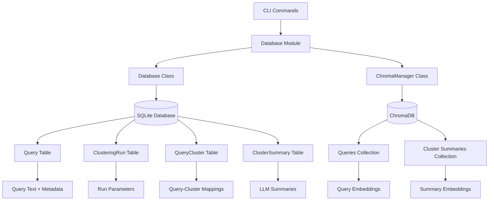
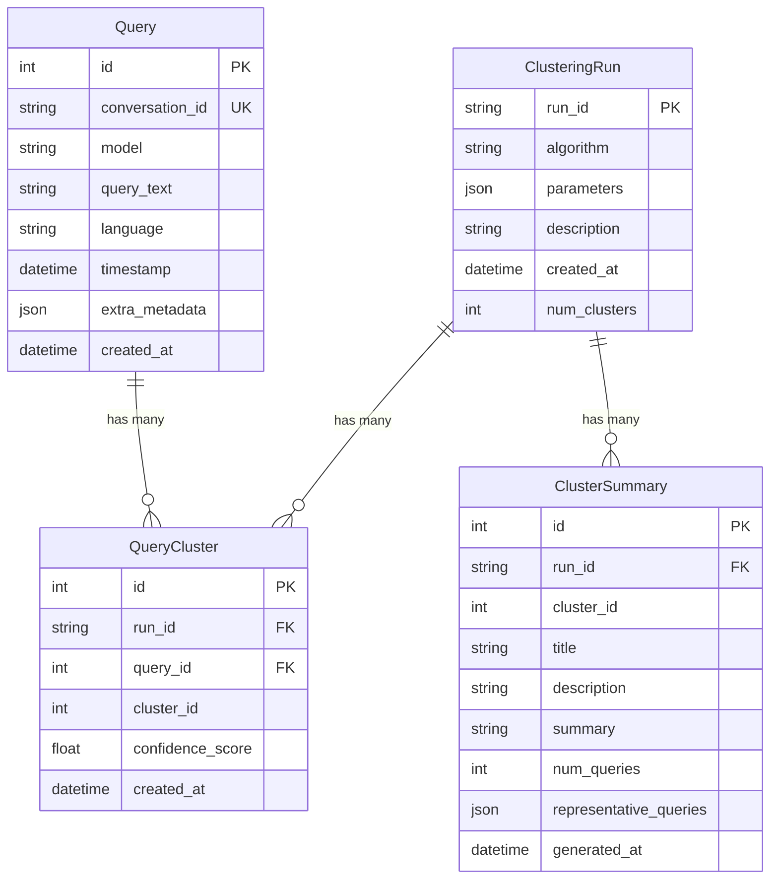
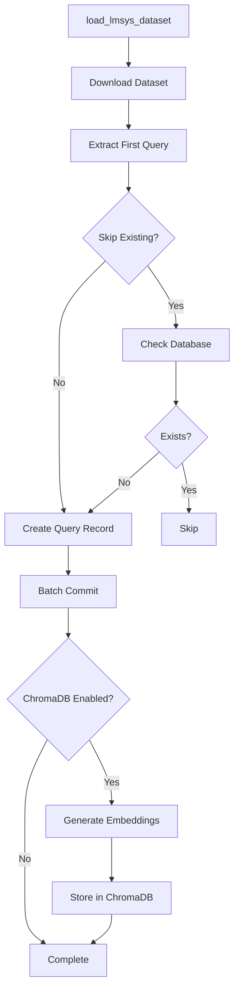
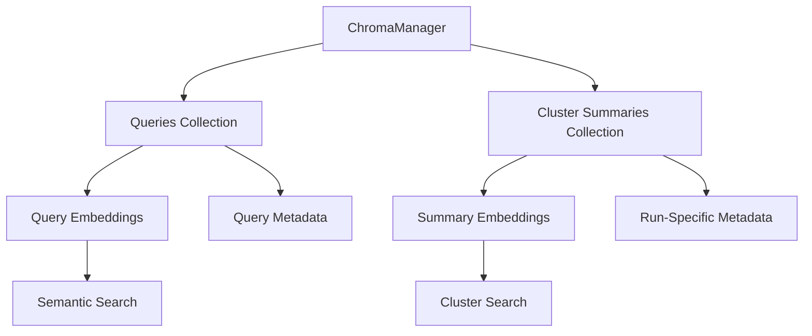
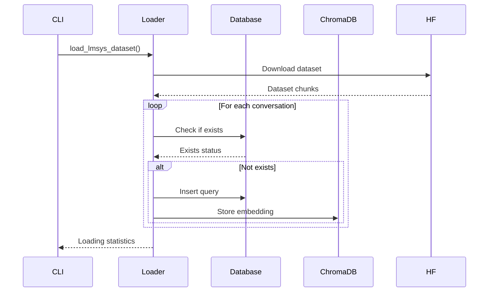
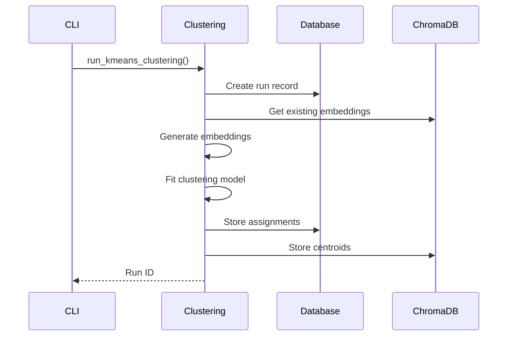
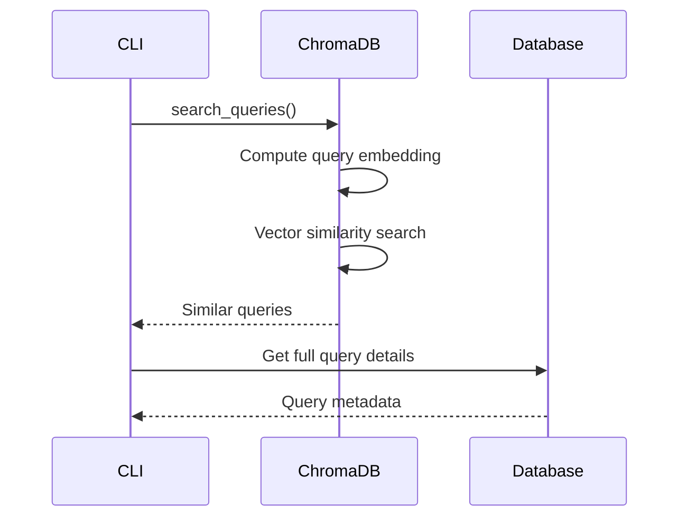

# Database Module

The database module handles data persistence using SQLModel (SQLAlchemy) with SQLite and provides ChromaDB integration for vector storage and semantic search.

## Overview

This module provides two storage layers:
1. **SQLite**: Relational storage for queries, clustering runs, and metadata
2. **ChromaDB**: Vector database for embeddings and semantic search

## Architecture

## Core Components

### Database Models (models.py)

### Database Connection (connection.py)

**Purpose**: Manages SQLite database connections and sessions

**Key Features**:
- Automatic table creation
- Foreign key enforcement
- Session management
- Default path configuration

**Flow**:

### Data Loader (loader.py)

**Purpose**: Downloads and loads LMSYS-1M dataset from HuggingFace

**Process Flow**:

**Key Functions**:
- `extract_first_query()`: Extracts first user message from conversation
- `load_lmsys_dataset()`: Main loading function with progress tracking
- Batch processing for performance
- Optional ChromaDB integration

### ChromaDB Manager (chroma.py)

**Purpose**: Manages vector storage and semantic search capabilities

**Collections**:

**Key Features**:
- **Batch Operations**: Efficient bulk inserts
- **Metadata Enrichment**: Adds SQLite IDs and run information
- **Search Capabilities**: Semantic search across queries and summaries
- **Run Isolation**: Cluster summaries filtered by run_id

**Search Methods**:
- `search_queries()`: Find similar queries
- `search_cluster_summaries()`: Find relevant clusters
- `get_query_embeddings_map()`: Retrieve embeddings for reuse

## Data Flow

### Loading Process

### Clustering Process

### Search Process

## Key Design Decisions

1. **Dual Storage**: SQLite for structured data, ChromaDB for vectors
2. **Batch Processing**: Efficient handling of large datasets
3. **Embedding Reuse**: ChromaDB caches embeddings to avoid recomputation
4. **Run Isolation**: Each clustering experiment is isolated by run_id
5. **Metadata Preservation**: All original data preserved with clustering results

## Performance Considerations

- **Chunked Processing**: Large datasets processed in chunks
- **Batch Commits**: Database writes batched for efficiency
- **Embedding Caching**: ChromaDB prevents redundant embedding generation
- **Indexing**: Database indexes on frequently queried fields
- **Memory Management**: Streaming approach for large datasets
