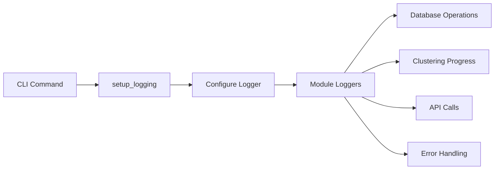
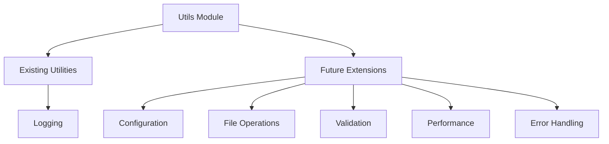

# Utils Module

The utils module provides shared utilities and helper functions used across the LMSYS Query Analysis system.

## Overview

This module contains common functionality for logging, configuration, and other shared operations that don't belong to specific domain modules.

## Components

### Logging (logging.py)

**Purpose**: Centralized logging configuration for the entire application

**Features**:
- Configurable log levels (DEBUG, INFO, WARNING, ERROR)
- Rich formatting with timestamps and module names
- Verbose mode support for detailed debugging
- Consistent logger naming across modules

**Usage Pattern**:

**Configuration**:
- **Default Level**: INFO
- **Verbose Mode**: DEBUG level with detailed output
- **Logger Name**: "lmsys" for consistent identification
- **Format**: Timestamp, level, module, message

**Integration Points**:
- CLI commands use `setup_logging(verbose=verbose)`
- All modules use `logging.getLogger("lmsys")`
- Progress tracking and error reporting
- Performance metrics and timing information

## Design Principles

### Centralized Configuration
All utilities follow a centralized approach to ensure consistency across the application.

### Minimal Dependencies
Utils are designed to have minimal external dependencies to avoid circular imports.

### Reusability
Functions are designed to be reusable across different modules and contexts.

## Future Extensions

The utils module can be extended with additional shared functionality:

### Potential Additions
- **Configuration Management**: Environment variable handling
- **File Utilities**: Path management and file operations
- **Validation Helpers**: Input validation and sanitization
- **Performance Monitoring**: Timing and profiling utilities
- **Error Handling**: Standardized exception handling patterns

### Extension Pattern

## Integration with Other Modules

### CLI Integration
- Logging setup called from CLI commands
- Verbose mode configuration
- Error reporting and user feedback

### Database Integration
- Database operation logging
- Performance metrics
- Error tracking and debugging

### Clustering Integration
- Progress tracking for long operations
- Algorithm performance metrics
- Debug information for troubleshooting

This module serves as the foundation for shared functionality across the entire LMSYS Query Analysis system, ensuring consistency and maintainability.
